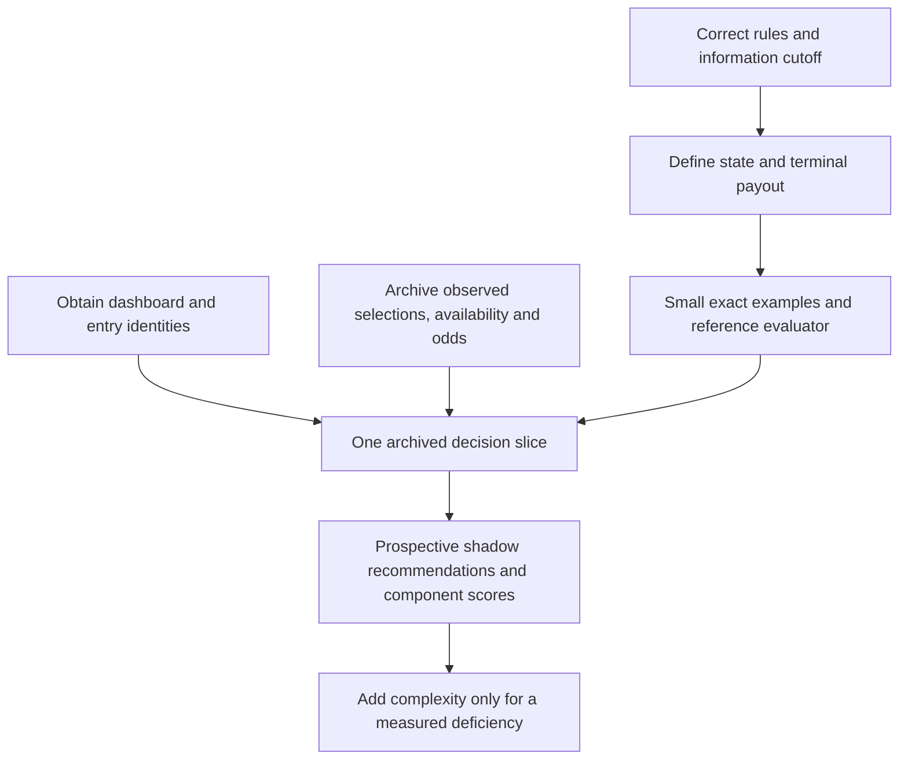

# Principal review - football-survivor - 2026-09-18

Reviewed against the owner's engineering principles and the project's documents-only decision. Window: the complete history through `c748ff1`, three commits, all dated September 16. This is the first review.

## Summary

The project has a useful problem framing and worthwhile data discoveries, but its research is not ready to serve as an implementation specification. The central payout transcription disagrees with the currently published rules, several mathematical conclusions exceed their assumptions, and the validation plan confuses model consistency with evidence of advantage. Preserve the scope, source discipline, and separation from Jamie's dashboard. Correct the model and establish a small reproducible evidence base before committing to the proposed optimizer.

## Scoreboard

| Date | Source files/commit | Plumbing share | Top-5 share | Tasks clean | Structural open |
|---|---|---|---|---|---|
| 2026-09-18 | N/A, no source commits | N/A | N/A | 2/8 | 0 filed, 4 proposed |

No prior baseline or predictions. History mining found zero source or test changes. Architectural churn and runtime performance are not measurable here.

## What happened

The kickoff describes a working dashboard elsewhere, three live entries, manual field-data entry, uncertain formulas, and a wish to improve the software and analysis. This repository deliberately narrowed that brief to research. Commit `673209b` created the transcript, vision, state, decision 0001, seven research chapters, bibliography, and eighteen open tickets. Commits `901fef7` and `c748ff1` corrected a numerical example and the pre-Thanksgiving pick count. There has been no implementation, experiment harness, archived dataset, or subsequent validation commit.

The history shows a large initial synthesis followed immediately by corrections. It does not establish recurring architectural friction. No code rewrite is warranted because there is no code to rewrite.

## What held up

- **Research before implementation was appropriate.** The payout discrepancy below is precisely the kind of information-model error that decision 0001 was intended to catch.
- **The three inputs are sensible.** Current win probability, opponent choices, and the opportunity cost of consuming a team all affect a sequential contest decision. None alone determines its value.
- **Expected payout and risk appetite are distinct.** The risk-objective owner ticket is legitimate. Entry-level payouts add, while dependence and the shared denominator still matter to portfolio decisions.
- **Official field data is valuable.** The downloaded Week 2 PDF contains the advertised availability grid. Its aggregate row gives 16,978 live entries and 8,851 with Jacksonville available, implying 8,127 surviving Jacksonville picks. The existence and usefulness of this source are verified. The entire per-entry dataset is not yet verified.
- **Several mathematical building blocks are sound in their stated restricted settings.** Fixed-cohort, independent, binary game outcomes permit exact convolution of survivor counts. The two-holiday matching conditions are correct for those two slots. A deterministic assignment maximizing summed log win probabilities is a useful survival benchmark. None of those statements establishes optimal season payout.
- **The de-vig example checks out.** For -1000/+650, multiplicative gives 0.872093, additive 0.887879, and power 0.897749 with exponent 1.131728. The approximately 2.6 percentage-point difference is real arithmetic. Which estimator is best calibrated remains empirical.
- **The proposed data boundaries are good.** Archive raw inputs, preserve source identities and timestamps, keep I/O outside the pure evaluator, and avoid rebuilding the existing dashboard.
- **The transcript speaker correction is supported by the body.** Jamie describes building the dashboard. Adam asks about the model and workflow. The transcript also shows Adam accepting the contrarian example later in the conversation, so the research should not describe his initial question as his settled position.

## Profiles

These are inferred and remain owner decisions.

| Profile | Job and skill | Today | Trajectory |
|---|---|---|---|
| Weekly operator, Jamie | Make an explainable, feasible choice and submit it on time, comfortable with odds and dashboards | Existing dashboard and manually entered availability | Compare alternatives across three entries and retain a decision and submission record |
| Analyst, Adam | Audit claims and measure whether changes help, comfortable with software and quantitative reasoning | Research notes, tickets, and another person's implementation | Reproduce a decision from archived information and test competing models |
| Risk principal, syndicate | Understand possible outcomes and authorize portfolio exposure | Informal conversation and shared stakes | Explicit risk policy and override authority |

## Walkthrough

All tasks are new. These exercise the repository's current research product, not Jamie's inaccessible application.

| Task | Profile | Verdict | Evidence |
|---|---|---|---|
| Identify the project scope and implementation status | Analyst | clean | README, VISION, STATE, and decision agree that no implementation exists |
| Find the outstanding owner inputs | Analyst | clean | `tk ready` exposes four owner tickets |
| Derive the final-week payout from the cited rules | Analyst | broken | Research substitutes surviving entries for successful submitters |
| Reproduce the claimed exact Week 1 contrarian multiplier | Analyst | broken | Required joint outcome/cohort distribution is not specified |
| Inspect an official current-field source | Analyst | workaround | Bibliography supplies a URL convention, a live fetch is required, no archived artifact exists |
| Verify the three entries and their remaining teams | Operator | impossible | Aliases and dashboard are absent |
| Replay a recommendation using only information available at submission | Analyst, trajectory | impossible | No replay or timestamped input corpus exists |
| Compare three-entry portfolios under agreed risk preferences | Risk principal, trajectory | impossible | Neither a risk decision nor an evaluator exists |

Clean: 2/8. The impossible tasks mostly reflect declared project maturity. They are not eight separate defects.

## Landscape

The market is more developed than the bibliography's failed fetches suggest. [PoolGenius's current Circa product](https://poolgenius.teamrankings.com/circa-survivor-picks/) advertises entry and opponent tracking, future popularity projections, season planning, paths optimized for EV or survival, and historical entry picks. Its proprietary methods were not inspected. These features do not prove model quality, but they invalidate confidence in the claim that public tools must guess all availability or cannot address the actual problem.

[Survivor Grid's own FAQ](https://www.survivorgrid.com/faq) demonstrates a two-game outcome-weighted survivor-share calculation, then says it extends across the slate. Public EV methodology is therefore not uniformly `a/p`. Neither this evidence nor the transcript tells us Jamie's implemented formula.

[The Odds API documentation](https://the-odds-api.com/historical-odds-data/) confirms paid historical snapshots from June 2020, with five-minute intervals from September 2022 and the closest snapshot at or before the requested time. This is a plausible source, not proof that every required book and market exists at every deadline, or that this provider is the only viable way to backtest.

The defensible differentiation is a transparent, reproducible decision process for these three entries. A claim of unique algorithmic edge needs measurement. Preserve the private analytical scope and dashboard boundary rather than expanding into a general product.

## Findings

### Structural

### S1. The payout and decision-time contract must be corrected before it becomes an invariant

Tier: Structural. Lenses: engineering, product, outward. Admission: promise made.

**Evidence.** `docs/research/01-contest-mechanics.md:21` assigns the final split to survivors. Rule 19(d)(iv) of the [currently linked rules](https://www.circasports.com/wp-content/uploads/2026/06/CircaSportsSurvivorContest.2026-FinalRules-19-JUNE-2026.pdf) instead names "all entries that successfully submitted a selection in the final Contest Week." I verified the rendered second page. The [official landing page](https://www.circasports.com/circa-survivor) repeats this wording.

Under the literal published rule, three final-week submitters and two survivors receive one-third each, including the eliminated submitter. The research gives each survivor one-half and the loser zero. This changes the modeled payoff, not just an explanatory paragraph. If Circa administers a different interpretation, obtain that clarification rather than silently substituting customary survivor rules.

The decision-time contract is incomplete too. An early-game selection must precede kickoff, and submission is irrevocable. A Saturday snapshot cannot represent every legal decision. Preserve the actual decision time, eligible unstarted games, already committed entries, and information observed by then. Thursday game results do not reveal the field's Thursday pick counts unless those counts were actually published before our decision. Availability files are a cross-check, while submission receipts are the official selection record.

**Proposal.** Write a corrected rules decision with explicit terminal branches and an information cutoff for each action. Cover three submitters/two survivors, sole survivor, wipeout, earlier elimination, missed submission, ties, and an early-game lock. Consider both a general event-time policy and an initially narrower Saturday-only policy. The former costs more modeling, while the latter deliberately excludes early-game opportunities.

**Prediction.** The next approved payout specification and its fixture table agree on all listed cases, including one-third rather than one-half in the three-submitter example unless a sourced clarification supersedes the published rule.

**Unlocks.** Correct `fs-0d0o`, `fs-rs6a`, `fs-fnhf`, and the claimed project invariant. Effort: days, with external clarification time unknown.

### S2. The proposed objective mixes terminal payout with interim equity

Tier: Structural. Lenses: engineering, product. Admission: promise made.

**Evidence.** `docs/research/06-solution-methods.md:148` adds this week's expected share to expected continuation value. But an ordinary nonterminal week pays nothing. If two entries certainly survive two remaining weeks and split the pool, the payout is one-half per entry, not one-half this week plus one-half next week.

The correct recurrence selects an action and averages mutually exclusive branches:

```
V(state) = max over legal actions of E[
    terminal payout                         if the contest resolves
    V(next state)                           if it continues
]
```

Own availability, opponent availability and identity/group structure, schedule, information state, and any surviving portfolio all affect `next state`. Two outcomes can have the same survivor count but different continuation values. Convolution of the count alone therefore cannot integrate a general continuation function exactly.

The multiweek formula in `02-objective-function.md:23` also pulls random terminal field size outside the wipeout expectation and omits the condition that our entry reached that resolving week. Even under the research's alternate terminal rule it needs a branchwise expectation and a defined zero-survivor case. Early current-field share does not bound eventual portfolio interaction: a negligible position today can become a large position on the rare paths that produce nearly all its payout.

**Proposal.** Define the state, transition, terminal payoff, and policy before selecting a solver. Label one-week survivor share as a diagnostic or explicit continuation approximation. Include our entries in candidate-specific cohort counts. Keep a small enumerable multiweek decision tree as the future correctness oracle.

**Prediction.** The two-week deterministic example evaluates to one-half per entry, and states with equal survivor counts but different remaining teams can produce different values. The evaluator reproduces an enumerated small tree for both single-entry and portfolio actions.

**Unlocks.** `fs-0d0o`, `fs-zj45`, `fs-z5j7`, and portfolio recommendations. Effort: days for the specification and tiny oracle, not an estimate for a production solver.

### S3. Observed selections, censored observations, and inferred behavior need separate identities

Tier: Structural. Lenses: engineering, product, outward. Admission: becomes and promise made.

**Evidence.** `fs-9x8g` plans to infer eliminated entries' picks through missing rows and expectation-maximization. Circa's page directly links a [Week 1 selections PDF](https://www.circasports.com/wp-content/uploads/2026/09/Circa-Survivor-2026-Week-1-Selections.pdf). I fetched its 113 pages and inspected the first page visually. It directly associates aliases with selections, including Chargers picks absent from the survivor grid. Historical coverage still needs checking, but inferred labels should not be the default where observed labels exist.

The next availability file does not report the complete previous pick vector. Missing entries can also represent no submission or disqualification, not just a losing-team choice. Filling their choices using the model and then scoring against those inferred labels is circular validation.

The documents also overstate parser verification. Aggregate parity cannot prove the joint state: swapping the remaining-team sets of two aliases preserves every team total. The 5,250-alias claim lacks archived evidence and a reproducible parser. The same chapter reports both 348 aliases with ten surviving entries and a 265-alias all-ten-survived sample without explaining the difference. Survivors-only concentration cannot establish behavior of all entrants. An alias is an observed grouping, not a proven independent decision-maker.

**Proposal.** Archive availability, selections, results, and rules separately. Keep source URL, bytes/hash, retrieval time, publication-time evidence, season, and contest leg. Distinguish observed, inferred, and unresolved labels. Validate row identities and transitions as well as aggregates, and investigate source coverage before committing to an imputation model.

**Prediction.** A verified Week 1 slice obtains directly observed Chargers labels from the selections source. Swapping two aliases' used-team sets fails an identity/transition check despite passing aggregate parity. No inferred label is represented as observed ground truth.

**Unlocks.** Rescope `fs-gkjt`, `fs-9x8g`, `fs-frk2`, and `fs-ri3y`. Effort: days for one verified slice, archive-wide effort unmeasured.

### S4. The evaluation plan cannot support its current claim of demonstrated advantage

Tier: Structural. Lenses: engineering, product. Admission: promise made.

**Evidence.** `docs/research/07-validation-and-backtesting.md:43` feeds realized field choices to strategies, then simulates outcomes under the same model used to optimize. This can diagnose an objective or measure an oracle-information advantage. It is not a deployable historical policy evaluation if those choices were published after submission, and it favors a strategy selected to optimize that simulator by construction.

The discrepancy becomes larger over multiple weeks. Changing historical outcomes changes who survives, their remaining teams, and future choices. One cannot resample game results while holding the actual future field path fixed. The existing plan does not specify how counterfactual fields evolve.

The proposed 2026 holdout has already influenced feature selection through Week 1. It can no longer honestly be an entirely untouched season. A prospective cutoff can still reserve future weeks. Many entry rows do not create independent game outcomes or independent weekly market conditions.

**Proposal.** Separate observed-outcome policy replay, explicitly labeled oracle diagnostics, and model-based counterfactual simulation. Simulate the complete state consistently on alternate paths. Evaluate components out of sample, report model sensitivity and Monte Carlo uncertainty separately, and preregister a prospective policy after a stated cutoff. A simulator win is evidence conditional on that simulator, not proof of real-world positive edge.

**Prediction.** Every evaluation names its estimand and available information. A future selections file cannot reach a policy input, and changing an early result changes the simulated downstream field. Any claimed improvement is accompanied by the assumptions under which it holds.

**Unlocks.** Rewrite the contract for `fs-fnhf` and the success criteria before optimizing to them. Effort: days for design, data-dependent effort for implementation.

### Incremental

### I1. Replace the season-wide strategic rules with conditional, reproducible claims

Tier: Incremental. Lenses: engineering, product. Admission: promise made. Effort: days.

The table at `02-objective-function.md:153` asserting a few-percent early edge and a 100x late edge has no derivation or measured support. Scaling fixed cohort counts by a common factor scales each one-week expected share by its inverse and preserves their ratio. Absolute entry count alone cannot establish that season pattern. The number of NFL games also bounds the sources of outcome diversification, regardless of how many entries select them.

The Week 1 example gives an average survival rate for the other entries without specifying their joint distribution. That is insufficient for an exact reciprocal expectation. For instance, with our cohort size 10 and other survivors of mean 50, a fixed 50 produces `1/60 = 0.016667`. Other survivors equal to 0 or 100 with equal probability produce `0.5/10 + 0.5/110 = 0.054545`. The same mean gives very different equity. Thus the reported 1.07x and 26x correction are not established exact historical findings.

Likewise, all three entries need not share the same available teams or continuation values. Current numerical smallness does not prove portfolio separability. An equal fraction of perturbations won does not imply equal expected payout, because the sizes of the wins and losses matter. A geometric extrapolation to about ten eventual survivors does not identify the mode of their distribution or the expected reciprocal payout.

Revise the research summary holistically. Preserve these as conditional hypotheses where appropriate. The next review should be able to reproduce every retained strategic multiplier from a fully specified fixture.

### I2. Resolve identifiability and information timing before adding advanced models

Tier: Incremental. Lenses: engineering. Admission: promise made. Effort: days for design corrections.

`03-inputs-win-probability.md:131` claims current-week spreads determine market-implied ratings for all future matchups. A full week's sixteen games provide at most sixteen pair-difference equations for thirty-two team ratings. Even with home advantage fixed, shifting both ratings within any matchup by the same amount preserves every observed spread and changes cross-matchup predictions. A connected multiweek dataset, priors, or regularization is necessary, and those choices introduce assumptions.

`05-future-value-and-constraints.md:102` solves an entire realized future rating path and averages assignment duals. That gives the optimizer future information unavailable to a real sequential decision-maker. Use it as a clearly labeled perfect-information benchmark, or constrain choices to information revealed by that decision time. More information can help, but a universal direction for each team's marginal shadow-price bias does not follow.

Continuation regression is a possible approximate dynamic-programming technique. This is not simply an optimal-stopping problem: the player must select a team each leg and does not choose when the contest pays. Regressing returns from one policy estimates that policy's value unless policy evaluation and improvement are specified. Defer regression, archetypes, and a latent outcome factor until simpler baselines expose a measured need. Preserve alias structure if compressing state by availability.

### I3. Correct the exactness and performance promises before implementing the solver ticket

Tier: Incremental. Lenses: engineering. Admission: promise made. Effort: hours to days for the contract.

The binary convolution in `06-solution-methods.md:8` omits ties, although ties eliminate both sides. Two-way moneylines also need their tie settlement interpreted before they become unconditional contest-win probabilities. Add explicit outcome states or label and measure an approximation. Continuous-factor integration is not automatically exact merely because convolution conditional on a factor is exact.

Combining general prefix and suffix distributions is another convolution, not a constant-cost multiplication. The document has not established its claimed all-candidate complexity. No timing was measured, so "microseconds" and "strictly better" than enumeration are unsupported. For a small slate, enumeration is an excellent reference method. Select an optimized implementation only after parity and counted-work measurements justify it. Exact floating-point equality is not an appropriate blanket acceptance criterion for different summation orders.

### I4. Make the next work slice an auditable decision, and obtain the existing baseline

Tier: Incremental. Lenses: product, engineering, outward. Admission: promise made. Effort: days once access exists.

`fs-2crt` correctly admits that nobody here has read Jamie's formula. The research nevertheless prescribes replacing it, asserts it aggregates before de-vigging, and claims a ranking defect. Those are unverified descriptions of another implementation. Get the repository/export, data contract, example output, and tests first. Preserve Jamie's current formula as a named benchmark once it is actually known.

Resequence the existing queue around one archived decision, exact small payout examples, known entry availability, simple field-choice baselines, and an explanation of alternatives. Historical paid odds are useful for realistic market backtests but do not block synthetic payout verification, source discovery, or current-input archiving. Risk preferences block a prescriptive portfolio recommendation, not all model research. Future regression and archetypes should depend on this evidence, rather than delaying every operational benefit until phase 5.

## Numerical verification

The original three-entry example is arithmetically correct under its assumed rule. Its numbers change under the literal published terminal rule. Our two entries choose X or Y, the rival chooses X, and independent probabilities are `Pr(X)=0.5`, `Pr(Y)=0.6`.

| Our choices | Research rule | Published-rule reading |
|---|---|---|
| XX | 0.666667 P | 0.666667 P |
| YY | 0.633333 P | 0.533333 P |
| XY | 0.733333 P | 0.766667 P |

These were recomputed by summing the four joint outcomes, with probabilities 0.3, 0.2, 0.3, and 0.2. Splitting still wins this particular example. The claim that both concentrated strategies lose the X-win/Y-loss branch is incorrect, because XX receives two-thirds there.

For independent games with cohorts 80 and 20 and win probabilities 0.8 and 0.7, the research's survivor-share diagnostic gives `0.0086` and `0.0126`. Multiplying both cohorts by 100 changes the values to `0.000086` and `0.000126`, retaining a ratio of 1.465116. This directly checks the scale argument without assuming it describes Circa's terminal payout.

Actual diagnostic output:

```
Review arithmetic diagnostics: 10/10 passed. This is not a project test suite.
```

The diagnostics checked six portfolio values, the terminal payout disagreement, cohort scaling, insufficiency of a mean for reciprocal expectation, and multiplicative de-vig rounding. An initial suspicion of a multiplicative rounding error was rejected by calculation. No project test suite exists to run. No benchmark timings were measured.

## How to proceed



First finish a bounded research correction: payout contract, recurrence, observed versus inferred data, and evaluation contract. Then explicitly supersede the documents-only gate when approving implementation. The first implementation milestone should produce one reproducible decision record with input timestamps, our available teams, legal choices, baselines, assumptions, and a runner-up comparison. A short-horizon or survival assignment baseline is acceptable if named honestly.

Develop in shadow mode alongside the existing workflow until the assumptions and comparison are credible. The present repo does not support replacing tomorrow's Week 2 selection process with its recommendations. Additional model complexity should be earned by error analysis on that small working path.

## Conflicts and owner decisions

- The live-season goal favors a useful incremental tool. The current five-phase sequence defers all use until the most speculative modeling is complete. A thin evidence-producing slice resolves much of this tension, but changing the research-only phase still needs an explicit project decision.
- Confirm that the primary goal is improving these three entries, rather than researching a new general optimization method. The former favors baseline access, input reliability, and decision auditability.
- Confirm the risk objective and who can override a recommendation. Expected payout can remain an analytical reference without pretending it is the agreed utility of every stakeholder.
- Jamie can seek confirmation of the terminal payout wording before live reliance on the disputed branch. No outreach was made by this review.
- All proposed work above is advisory. No new tickets were filed or existing tickets changed.

## Method and limits

Read the full research set, transcript, project instructions, decision record, all eighteen tickets, and all three commits. Ran the principal-review history script and `tk ready`. Independently checked current official rules and public tools, fetched primary PDFs, rendered the relevant rule page and data pages, and recomputed small examples. A parallel source-checking agent located evidence, which was verified directly for the findings above.

The downloaded primary files are scratch artifacts under `/tmp`. SHA-256 values observed in this review:

| Source | SHA-256 |
|---|---|
| Rules, June 19 revision | `9c51eee58b7ddd4f00628e4dc1a1fc2b5970e28b324a111a6326d3da15093b0f` |
| 2026 Week 1 selections | `58fb8da9a9e7af0052d4504f103366be6a9694d843e9f6929a12d61d778ca2c5` |
| 2026 Week 2 availability | `99cac883b9ba772dfd07d1f5eaac6498455cab6439343fdca54d6129f6eb5ad8` |

Untested-assumptions inventory:

| Assumption or limit | Confidence | Basis or next check |
|---|---|---|
| Published terminal wording differs from the research | High | Rendered PDF and official landing page agree |
| Circa's operational interpretation follows that literal wording | Medium | Obtain clarification before relying on an unusual branch |
| Availability and selections are usable inputs | High for inspected pages | Full parser and reconciliation remain unbuilt |
| Complete historical selection and availability coverage | Low | No comprehensive archive audit performed |
| Historical publication times are recoverable | Low | PDF creation time is not proof of public availability |
| Alias groups identify independent owners across seasons | Low | Not established by these PDFs or a successful join |
| Jamie's algorithm is defective | Unknown | Dashboard implementation unavailable |
| Proposed strategy beats current practice | Unknown | No empirical policy comparison exists |
| Calibrated future ratings or opponent models exist here | Unknown | Specifications only, no fitted artifacts |

Only this review record and its index were added. Research, accepted decisions, ticket state, and code were not changed. The record is left uncommitted because this session's filesystem permissions make `.git` read-only. No push or external mutation was attempted.

## Not in scope

Minor prose and notation corrections belong in the subsequent research-correction pass. No style cleanup or implementation work was absorbed into this assessment.
